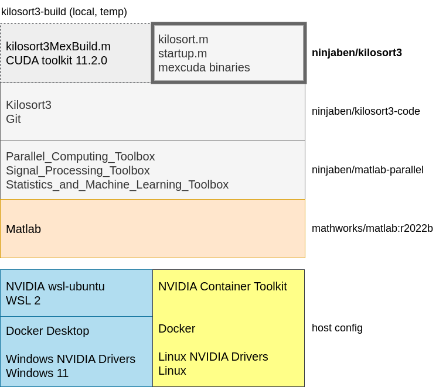

# kilosort3-docker
Automated build of Docker image with Kilosort3, Matlab, required toolboxes, and precompiled mexcuda binaries.

This is a work in progress.

# What is this?
To goal of this repo is to document and produce a working [Kilosort3](https://github.com/MouseLand/Kilosort) environment as a Docker image.

This takes advantage of Docker tooling provided by Mathworks, including a Matlab [base image](https://hub.docker.com/r/mathworks/matlab) and [Dockerfile](https://github.com/mathworks-ref-arch/matlab-dockerfile/blob/main/Dockerfile) and the [mpm](https://github.com/mathworks-ref-arch/matlab-dockerfile/blob/main/MPM.md) package manager.

The basic requirements of Kilosort3 are the same with or without Docker: a Matlab license and NVIDIA GPU hardware.  Hopefully other setup and testing chores can be captured here in this repo, making those things easier to reproduce and share. 

# Outline
Here's a summary of the host config and Docker image stack that go into this Kilosort3 environment.



## Host config
Some host configuration is required to support GPU-accelerated Docker containers.  It should be possible to accomplish equvalent setup on Windows 11 or Linux, and to use the same Docker images from there.

### Windows 11 plus Linux via WSL 2
NVIDIA Docker setup for Windows 11 is documented well by both [Canonical](https://ubuntu.com/tutorials/enabling-gpu-acceleration-on-ubuntu-on-wsl2-with-the-nvidia-cuda-platform#3-install-nvidia-cuda-on-ubuntu) and [NVIDIA](https://docs.nvidia.com/cuda/wsl-user-guide/index.html#cuda-support-for-wsl-2).

The setup requires Windows 11 (or some later builds of Windows 10).  It uses **Windows** NVIDIA drivers installed via the standard process **in Windows**.  It is surprising but true that Linux containers running under Windows will use the **Windows** NVIDIA drivers, not the Linux drivers.

The [Windows Subsystem for Linux Version 2](https://learn.microsoft.com/en-us/windows/wsl/install) (WSL 2) will run a real Linux kernel alongside Windows itself and will expose the Windows NVIDIA drivers to Linux distros running within WSL 2.  [Docker Desktop](https://docs.docker.com/desktop/install/windows-install/) installed **in Windows** will use WSL 2 to run Linux containers with full kernel support.  The containers can be launched from Windows or from a Linux distro running within WSL 2.

Finally, the setup includes NVIDIA's [cuda-wsl-ubuntu](https://docs.nvidia.com/cuda/wsl-user-guide/index.html#cuda-support-for-wsl-2) package, which provides NVIDIA management tools but won't clobber the NVIDIA driver stubs that connect Linux to the Windows drivers.

### Regular Linux
NVIDIA Docker setup for Linux might be hard to document in general.  But the key requirements are to install:

 - Linux distro with [Linux NVIDIA drivers](https://docs.nvidia.com/cuda/cuda-installation-guide-linux/)
 - [Docker](https://docs.docker.com/desktop/install/linux-install/)
 - [NVIDIA Container Toolkit](https://docs.nvidia.com/datacenter/cloud-native/container-toolkit/install-guide.html)
 
 If you are lucky, all of these might be available from your distribution's package manager.  Here's one Medium post that gives a possible [overview on Ubuntu](https://towardsdatascience.com/how-to-properly-use-the-gpu-within-a-docker-container-4c699c78c6d1).

## Docker images
The main artifact produced from this repo is a Docker image called [ninjaben/kilosort3](https://hub.docker.com/repository/docker/ninjaben/kilosort3/general).  You shold be able to pull this image onto a configured host and start running Kilosort3 (see example commands, below).

This image is built up from a few layers that add Kilosort dependencies:

### `ninjaben/matlab-parallel`
This image starts from the offical [mathworks/matlab:r2022b](https://hub.docker.com/layers/mathworks/matlab/r2022b/images/sha256-57ca75286d78269ccbec9da5de91bf223e0e3221387ad4cff23f9c9f1e054caa?context=explore) image.  It uses [Matlab Package Manager](https://github.com/mathworks-ref-arch/matlab-dockerfile/blob/main/MPM.md) to install the Matlab toolkboxes required for Kilosort:

 - Parallel_Computing_Toolbox
 - Signal_Processing_Toolbox
 - Statistics_and_Machine_Learning_Toolbox

The [ninjaben/matlab-parallel](https://hub.docker.com/repository/docker/ninjaben/matlab-parallel/general) image is available on Docker Hub.

### `ninjaben/kilosort3-code`
This image builds on `ninjaben/matlab-parallel` and adds Git, [Kilosort3](https://github.com/MouseLand/Kilosort), and [npy-matlab](https://github.com/kwikteam/npy-matlab).  It keeps Git installed as a way to check and report the commit hashes of cloned toolboxes.

It also adds a test script, `testKilosortEMouse.m`, to serve as an automated test of the whole environment (see example commands, below).

The [ninjaben/kilosort3-code](https://hub.docker.com/repository/docker/ninjaben/kilosort3-code/general) image is available on Docker Hub.

### `kilosort3-build`
This image can be created locally and used temporarily.  It builds on `ninjaben/kilosort3-code` and adds [NVIDIA CUDA Toolkit version 11.2](https://developer.nvidia.com/cuda-11.2.0-download-archive?) which is the version of CUDA Toolkit [required for Matlab r2022b](https://www.mathworks.com/help/parallel-computing/run-cuda-or-ptx-code-on-gpu.html).

Using this image, the script `kilosort3-build/build.sh` can run a one-time Docker container with Matlab, which calls [mexcuda](https://www.mathworks.com/help/parallel-computing/mexcuda.html) to compile GPU-accelerated mex-functions.  First it compiles the Mathworks [mexGPUExample](https://www.mathworks.com/help/parallel-computing/run-mex-functions-containing-cuda-code.html) function as a diagnostic for `mexcuda` and runtime configuration (see example commands below).  Then it compiles Kilosort's own GPU-accelerated mex-functions.  It copies all the resulting mex binaries out of the container, to be saved in this repo and included in the final `ninjaben/kilosort3`, below.

Since this step runs in Matlab it's not a good fit for automated building with GitHub and Docker Hub.  This is unfortunate, since it interrupts the simplicity, reproducibility, and beauty of an end-to-end, automated build.  But given the Matlab licensing constriant we may have to live with this.  Here are a few consolations:

 - This temp build image has the same parent image as the final `ninjaben/kilosort3`, so the two will be consistent and compatible.
 - Everything required to create the temp build image and run a container from it (with the exception of the Matlab licence) is versioned here in this repo.
 - The precompiled binaries themselves are also versioned here in this repo.
 - This temp build image is a natural place to set aside the large CUDA Toolkit, and limit the size of downstream images (sort of like a Docker multi-stage build).

### `ninjaben/kilosort3`
This is the final image built from this repo.  It builds on `ninjaben/kilosort3-code` and adds precompiled binaries for Kilosort's GPU-accelerated mex-functions -- the binaries created in the previous step.   You shold be able to pull this image onto a configured host and start running Kilosort3 (see example commands, below).

The [ninjaben/kilosort3](https://hub.docker.com/repository/docker/ninjaben/kilosort3/general) image is available on Docker Hub.

# Example Commands
Here are some example `docker run` commands that should help you run `ninjaben/kilosort3` containers on a confiured host.

## Diagnostic
You can run the Mathworks [mexGPUExample](https://www.mathworks.com/help/parallel-computing/run-mex-functions-containing-cuda-code.html) to check if the host, Docker, CUDA, and Matlab are all working together.

This example uses a local Matlab license, specific to the host MAC address.  There are also more ways to configure the license, documented in the [Matlab readme on Docker Hub](https://hub.docker.com/r/mathworks/matlab).  You'll probably need to edit this command a bit to reflect your license situation.

```
LICENSE_MAC_ADDRESS=$(cat /sys/class/net/en*/address)
LICENSE_FILE="$(pwd)/license.lic"
docker run --gpus all --rm \
  --mac-address "$LICENSE_MAC_ADDRESS" \
  -v "$LICENSE_FILE":/licenses/license.lic \
  -e MLM_LICENSE_FILE=/licenses/license.lic \
  ninjaben/kilosort3:v0.0.3 \
  -batch "shouldBeTwos = mexGPUExample(ones(4,4,'gpuArray'))"
```

After a successful run, Matlab should print a 4x4 matrix of twos:

```
shouldBeTwos = 

    2    2    2    2
    2    2    2    2
    2    2    2    2
    2    2    2    2
```

## Kilosort3 test
If the diagnostic above looks good, then a similar command should work for testing Kilosort3 itself.

```
LICENSE_MAC_ADDRESS=$(cat /sys/class/net/en*/address)
LICENSE_FILE="$(pwd)/license.lic"
docker run --gpus all --rm \
  --mac-address "$LICENSE_MAC_ADDRESS" \
  -v "$LICENSE_FILE":/licenses/license.lic \
  -e MLM_LICENSE_FILE=/licenses/license.lic \
  ninjaben/kilosort3:v0.0.3 \
  -batch "testKilosortEMouse()"
```

After a successful run, Matlab should print a success message:

```
We found some good clusters:
  ... good cluster counts ...
```

The function `testKilosortEMouse.m` comes from this repo and is based on Kilosort's [eMouse example](https://github.com/MouseLand/Kilosort/blob/main/eMouse_drift/main_eMouse_drift.m).  It's been reshaped to run unattended, support Linux, and to report sanity check assertions.  This is needed because [as of 2022](https://github.com/MouseLand/Kilosort/issues/476) Kilosort3 doesn't have an automated test suite we can run.

## Kilosort3 spike sorting
If the Kilosort test above looks good, then you could try doing some actual spike sorting.

You might want to bring your own scripts and data for this, perhaps in dirs on the host called `/my/kilosort/code` and `/my/kilosort/data`.  You can mount these dirs into the container's file system, then call your own Kilosort code and point it at your data.

```
LICENSE_MAC_ADDRESS=$(cat /sys/class/net/en*/address)
LICENSE_FILE="$(pwd)/license.lic"
docker run --gpus all --rm \
  --mac-address "$LICENSE_MAC_ADDRESS" \
  -v "$LICENSE_FILE":/licenses/license.lic \
  -e MLM_LICENSE_FILE=/licenses/license.lic \
  -v /my/kilosort/code:/my/kilosort/code \
  -v /my/kilosort/data:/my/kilosort/data \
  ninjaben/kilosort3:v0.0.3 \
  -batch "myKilosortFunction('/my/kilosort/data/a/b/c')"
```

I hope this is helpful and fun -- good luck!

# A Point about Image Sizes
Here are the rough, uncompressed sizes of images produced during the build process for this repo.

```
REPOSITORY                 TAG      SIZE
mathworks/matlab           r2022b   5.85GB
ninjaben/matlab-parallel   v0.0.3   10.1GB
ninjaben/kilosort3-code    v0.0.3   10.3GB
kilosort3-build            temp     18.4GB
ninjaben/kilosort3         v0.0.3   10.3GB
```

The Matlab base image brings in >5GB to start with.  Adding the required toolboxes takes the image to >10GB.  This is somewhat cumbersome, but normal for Matlab installs.  So far this seems not to be a problem for Docker or Docker Hub.

Installing CUDA Toolkit nearly doubles the image size to >18GB!  This seems like a lot to ask.  That's why the final `ninjaben/kilosort3` image omits CUDA Toolkit and only includes precompiled mex binaries.
